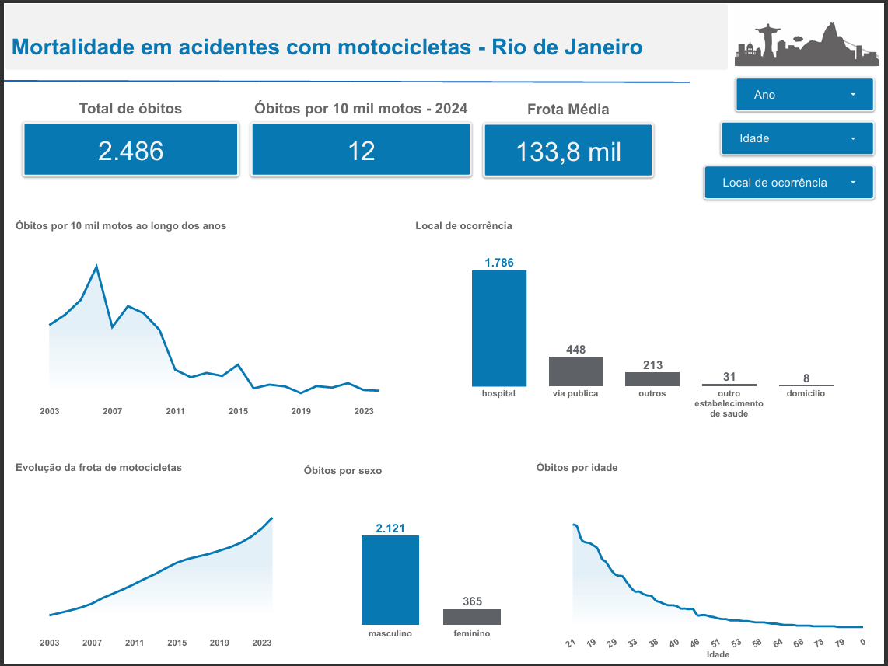
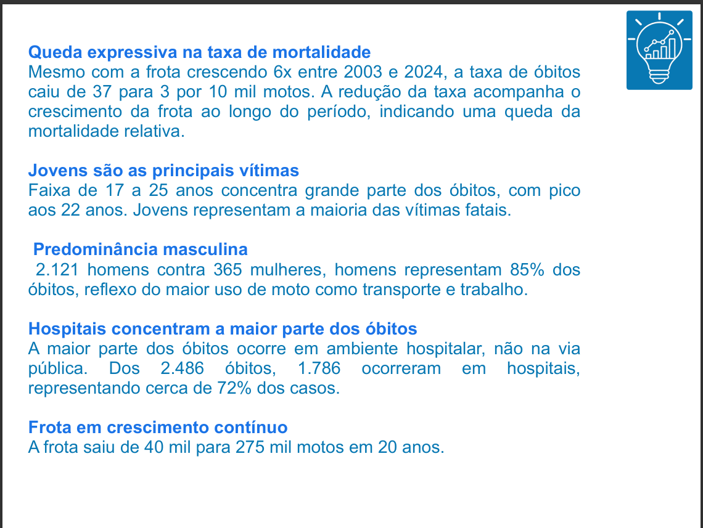

## Mortalidade em Acidentes com Motocicletas - Rio de Janeiro (2003-2024)

Análise dos óbitos causados por acidentes com motocicletas e motonetas no município do Rio de Janeiro, cruzando dados de mortalidade, frota de veículos e população.

## Stack

- **Python** (pandas, matplotlib, seaborn) — coleta, tratamento e validação dos dados
- **BigQuery** - armazenamento e análise
- **Looker Studio** - dashboard interativo
- **Base dos Dados** - fonte dos dados públicos (SIM/MS e DENATRAN)

## Dashboard

## Pipeline de dados (BigQuery)

O projeto segue um fluxo em 3 camadas dentro do BigQuery:

1. **Views** (`vw_*`) - dados brutos filtrados diretamente da Base dos Dados
2. **Tabelas tratadas** (`vw_*_ready`) - dados validados e limpos pelos scripts Python
3. **Tabelas de análise** (`tb_*`) - resultado final das agregações, usadas diretamente no dashboard do Looker Studio

## Estrutura

- `scripts/dados_frota.py` - tratamento dos dados de frota (DENATRAN)
- `scripts/dados_mortalidade.py` - tratamento dos dados de óbitos (SIM/MS)
- `scripts/dados_populacao.py` - tratamento dos dados populacionais
- `scripts/analytics_motociclistas_rj.py` - análise e exportação das tabelas finais para o BigQuery

## Principais achados

- Taxa de mortalidade caiu de 37 para 3 óbitos por 10 mil motos entre 2003 e 2024
- Jovens de 17 a 25 anos concentram a maior parte dos óbitos, com pico aos 22 anos
- 85% das vítimas são homens
- 72% dos óbitos ocorrem em hospital, não na via pública
- Frota cresceu de 40 mil para 275 mil motos em 20 anos

## Fonte dos dados

- **SIM/MS** - Sistema de Informações sobre Mortalidade (CID-10: V20–V29)
- **DENATRAN** - Frota de veículos por município
- Acesso via [Base dos Dados](https://basedosdados.org)
